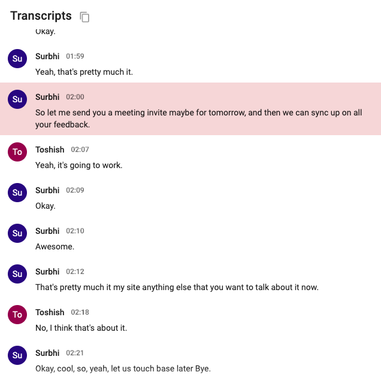
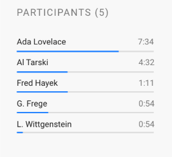
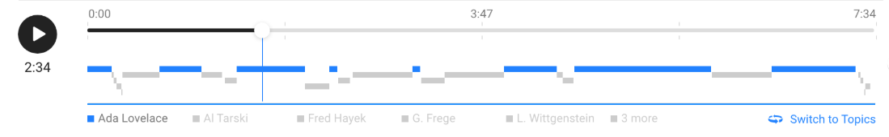
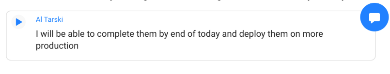
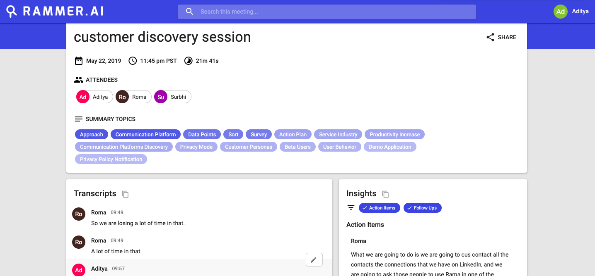

# Welcome to rammer.ai

[rammer.ai](https://rammer.ai)'s Language Insights Platform is aimed at addressing the need of understanding and analyzing human conversations. Based on such conversations, actionable insights are generated that can further be used to generate business outcomes. The purpose is to enable conversational intelligence on communication or collaboration platforms, such that these platforms can focus on providing an enhanced user experience using the technology provided by rammer.ai.

<aside class="notice">
In a hurry? Get started quickly with Rammer's <a href="#Welcome-to-rammer.ai">First Attempts</a>.
</aside>

# Overview: The Platform

Rammer.AI’s Language Insights platform provides Conversational Intelligence as a service. The platform enables a real-time intelligence in business conversations, recognising action items, insights, topics etc.

There are multiple use-cases currently being explored using the platform by our customers, products and their developers including use-cases for meetings or unified communication and collaboration, sales, workflow management and recruitment. This guide will help you understand the platform’s capabilities and mapping them to your use case.

## What is conversational intelligence ?

In its pure form, Conversational Intelligence refers to the ability to communicate in ways that create a shared concept of reality. It begins with trust and transparency to remove biases in decisions, help knowledge workers to be more effective at their core function, to eradicate the mundane and repetitive part of their work and make them feel more empowered at work and beyond. Here, we are trying to use machine learning and artificial intelligence to augment the capabilities of humans to analyze conversations and convert them to knowledge and actions such that they can outcomes can be scaled.

## How is it different from chatbot platforms?

Chatbots or virtual assistant platforms are commonly command-driven and referred to as Conversation AI systems. They add intelligence to human and machine direct interaction via auditory or textual methods to convincingly simulate how a human would behave as a conversational partner.

You can build these by using existing intent-based systems like RASA, DialogFlow, Watson, Lex, etc. -  that perform intent identification based on the training data you provide. Such a platform helps you create conversation workflows between humans and machines.

We are building a platform that can contextually analyze natural conversations between two or more humans based on the meaning as opposed to keywords/wake words.  You can analyze communications on both textual or audio channels to offer recommendations of outcomes without any training the engine every time for a new intent. Imagine embedding a passive intelligence in existing products or workflows, natively. Every bit of conversation data flowing through the systems is no more lost and help enable real-time actions and outcomes.

Read more about [Use cases](useCases.md) and [Capabilities](capabilities.md) here

> **Next:** Explore Use Cases supported by Rammer's Language Insight Platform: [Use Cases](useCases.md).

# Use Cases

## Meeting Intelligence

Augment an existing note-takers ability, by adding automated recommendations of action items and next steps as part of your existing workflow.

Real-time recommendations enable in-context note taking and is useful for meetings where there is already someone doing the job of taking action items. Post-meeting summaries are helpful for users that like to get more involved in the conversation and prefer re-visiting information and sending minutes of meetings after.

### End-User Value:

-   Remove biases from the information gathered
-   Increase productivity and participation
-   Have access to the information generated - easily navigate using Titles and Insights
-   Understand the overall patterns in an organization meeting culture - Sentiments in meetings, talk ratios, most productive conversations, etc.

## Sales Intelligence

Improve net sales performance by empowering sales agents to augment sales conversations with automated recommendations of next steps to never miss an opportunity. Identify the best performing agents and replicate their scripts for better sales enablement across the process.

### End user value: Sales Agent

-   Real-time analysis & insights from the  conversation
-   Real-time suggested actions
-   Auto scheduling tasks and follow ups through outbound work tool integrations
-   Full, searchable transcript of the sales conversation
-   Automatically make the post call entry in to the CRM

### End user value: Sales Enablement/VP of Sales
- High-level view of performance of the sales function
- Customisable dashboard to view calls in different filters
- Understand what topics, questions of competitor mentions work positive in a sales call
- Replicate best performing agents scripts to train the rest of the agents

## Customer Support Intelligence

Improve customer experience by increasing the human connection on the support and service calls

Real-time contextual understanding leading to suggested actions could customer service agents offer a great level of differentiation in customer experience. Analysis of support conversations over a period of time can help understand pain-points, topics of customer support conversation etc.
The platform is also capable of automating post call data collection.

### Benefits: Support Organisation

- Improved customer experience due to better support conversations
- Faster issue resolution due to automated suggestive actions
- Emotional, Sentimental analysis of conversational data
- Better data for coaching and benchmarking support staff
- High level understanding of topics and summaries of support conversation

> **Next:** Learn more about the [Capabilities of the Platform](capabilities.md).

# Capabilities:

## Transcript

The platform provides a searchable transcript with timecodes and speaker information. The transcript is a refined output of the speech to text conversion. As a platform, we don’t have an inbuilt speech to text capability but are compatible with a range of ASR APIs including Google, Amazon etc.

The transcript is one of the easiest ways to navigate through the entire conversation. They can be filtered using speaker specific or topic specific filters. Additionally, each insight or action item can also lead to related parts of transcript.



These transcripts can be realtime for voice and video conversations. They can also be accessed through the post conversation summary UI.

The post conversation summary page enables editing, copying and sharing of transcripts from the conversation.


## Speakers Separation

Audio streams and transcripts are partitioned into homogenous segments based on speaker identity. This is done with the help of speaker events and the process of Speaker Diarization.





## Timeline

The entire conversation is represented in a spatial format using the timeline feature. The timeline could show speakers, topics and specific events in the conversation like action items or insights. The timeline makes navigating around a conversation easier and very intuitive.




The timeline can also help in understanding how the sentiment/emotion has been changing throughout the conversation.

With appropriate work tool integrations, timelines can also help track follow-ups and tasks that were assigned and completed over time.


## Summary Topics

Summary Topics represent the key things that were talked about in the conversation. They provide a quick overview of what were the summarized topics of the conversation. Summary topics are not detected based on the frequency of their occurrences in the conversation, but they are detected contextually, and each summary topic is an indication of one or more important topics of discussion in the conversation.

Each summary topic has a score that indicates the importance of that topic in the context of the entire meeting. It is not that rare of the case that even less frequently mentioned things are of higher importance in the conversation, and it will be indicated by a higher score in those cases, even if other summary topics have a high number of mentions in the overall conversation.

### Contextual hierarchies
The Summary Topics has contextual hierarchies in them. High-level topics represent various concepts that the conversation is about. And Lower level topics are aspects of those high-level concepts which provide more contextual understanding about the high-level concepts discussed in the conversation.

For example, higher-level concepts could be Pricing or Revenue or Production Issues, etc. and lower level aspects for these could be like these -

| High Level (Concept) | Low Level (Aspect) |
| :----------: |:------------:|
| Pricing        | Selling Price, Paying Capacity, Cost-based pricing
| Revenue   | Revenue Growth, Higher Margin, Revenue Model  |
| Production Issues  |  Critical Issue, Downtime, Unstable Production |


This table just shows how the “Aspects” provide more information about one or more “Concepts” in the conversation. And by looking at it you can understand what different aspects each high-level concepts were discussed in any given conversation.

## Action Items

An action item is a specific outcome recognized in the conversation that requires one or more people in the conversation to take a specific action. For eg, Set up a meeting, share a file, complete a task, etc.

### Action Item Features
- Recognition of the Assignee and Assignor of an Action Item when possible
- Recognition of the date and time specified in the insights
- Make use of the Speaker context to enhance the quality of the insights
- Ability to accept the timezone to calculate the accurate date and time references
- Ability to control the confidence threshold for the insights
- Built-in punctuation and sentence boundary detection; ability to disable if already has well punctuated and formatted textual representation of conversations.

There are various types of actionable parts in the conversation between people and the platform can recognize these various connotations.

#### Definitive

A definitive connotation is used to indicate importance, definitiveness, and predictability of a certain action. Usually, this type of action items indicates the commitment to the Task.

Examples:

"We need to fix all the critical issues by tomorrow". Here, there is a definite requirement for a group of people indicated by "we" to fix the critical issues by tomorrow.
"Please make sure that the hall is booked for 25th". Here, even though the tone of the action item is not a command, still the request suggests that this task need to be completed.

The platform can recognize these types of connotations on top of recognizing the actionable item itself and indicate that in the output.

#### Non-Definitives

There can be other actionable items that may not be definitive in nature but still, indicate some future action.

For example, it can be simply an opinion of someone, to indicate future action.

"I think we should spend more time reviewing the document".  Here, to spend more time in review of the document is an opinion of this person but it's not something they are committing to.

#### Tasks

Definitive action items that are not follow ups are categorised as tasks.

Example:
"I will complete the presentation that needs to be presented to the management by the end of today".
Here, a person is really committed to completing the presentation(task) by the end of today.

#### Follow Ups

The platform can recognize if an action item has a connotation which requires following up in general or someone in particular.


Examples:

"I will talk to my manager and find out the agreed dates with the vendor". Here, a person needs to follow up with their manager in order to complete this action.

"Perhaps I can submit the report today". Here, the action of submitting the report is indicated, but the overall connotation of it doesn't indicate the commitment.

Follow ups can also be non-definitive

Example:

“We’ll need to sync up with the design team to find out more details”.
Here, it’s clear that there needs to be a follow up, but the details on when and how are not defined.

|  | Follow Up | Non-Follow Up |
| :----------: |:------------:| :------------:|
| Definitive        | Follow Up(defined data) | Task |
| Non-Definitive   | Follow Up (non defined)  | Idea/Opinion  |


## Other Insight Types

### Questions

Any explicit question or request for information that comes up during the conversation, whether answered or not, is recognised as a question.

Examples:

“What features are most relevant for our use case?”
“How are we planning to design the systems?”


### Metadata

The platform supports access of certain metadata on the conversation through the API. These metadata could be one of the following

- Time taken by individual speaker or topic
- Idle time
- Ratios like talk to listen ratio
- Number of action items occurring in particular conversation
- Number of Questions occuring in particular conversation


## Suggestive Actions

For each of the Action Item identified from the conversation, certain suggestive actions are recommended based on available worktool integrations.

Example:

‘Add to calendar’ is recommended as a suggestive action for all follow up actions
With integrations like Jira/Trello, Tasks can have a suggestive action to be added to the card
Ideas/Opinions can have a suggestive action to be shared on slack/skype etc

## Outbound Tool Integrations
The platform currently offers Email and calendar as out of the box integrations. However, this can be extended to any work tool where the actionable insights need to be pushed to enhance productivity and reduce the time taken by users to manually enter information from conversations. The same integrations can be enabled as suggestive actions to make this even quicker.
Some of the examples of these work tools could be sales platforms such as Salesforce, Copper; task management solutions such as Trello, Google Tasks; Calendars; Project Management Tools such as Monday, Asana or even Collaboration platforms such as Slack, Flock etc.

<!-- ## Inbound Tool Integrations
TODO: Integrations to initiate the conversation from. Examples - Calendar, Email, Voice and Text APIs and SDKs, Various Conferencing platforms
-->
## Sentiment Analysis
*(Access to this feature is invite-only, contact sales for more information)*

The platform has the inbuilt capability to identify sentiments based on contextual understanding of each conversation. The conversation itself could also have a generic sentiment that’s varying throughout the conversation.

With a contextual understanding, the platform could analyze what topic/person added positive sentiment to the conversation and what added negative.


## Emotion Analysis
 *(Access to this feature is invite-only, contact sales for more information)*

The platform can help analyse the emotions of participants specific to discusssed topics or questions in the conversation through the contextual understanding. This can help reveal different emotions that the participant(s) could have had towards a topic or a part of the conversation like - Happy, Sad, Angry, Fearful, Excited or Bored etc.


## Reusable and Customizable UI Components
The pre-built UI components can be widely divided into two areas
1. Real-time UI components
2. Summary Page UI

### Real-Time UI Components

Real-time UI Components help showcase the transcription, insights and action items during the conversation itself. These are customisable, embeddable components that can be directly used in any product.

Real-time UI components are available for

- Live transcripts
- Insights
- Action Items
- Suggestive Actions

 Example:



### Summary Page UI

At the end of each conversation, a summary of the conversation is generated and the page url is shared via email to all(or selected) participants.

The Summary page UI includes the following components
- Title and details of the conversation including date, number of participants, etc.
- Names of all the participants
- Topics covered in the conversation in the order of importance
- Full, searchable transcript of the conversation. Transcripts can be edited, copied and shared
- Any Insights, action items or questions from the transcript. Insights can also be edited, shared or dismissed, date/assignee for action item to be modified



The post conversation summary page is also fully customizable as per the use case or product requirement.

## Planning your Integration

1. Select the conversation channel you want to analyze
  * Voice or Video
  * Text
2. Finalize the user experience, journey and value metrics.
3. Select the Interface based on:
* Real Time
* Post Conversation
4. Select the Speech to Text Vendor (Not applicable for text data)
5. Get started with the API first validate the data needed to create the experience
6. Go to [Reference Guide for Text API](gettingStarted/quickStartTextApi.md) or [Reference Guide for Voice API](gettingStarted/quickStartVoiceApi.md)

# Prerequisites before you start

There are few things that you'll need before you can make your code work with any of the Rammer's API.

## Credentials
You need to have the valid application credentials provided by Rammer's team.
You should have valid `appId` and `appSecret` with you in order to generate the access token for API access.

>The credentials are provided to only selected parties, so you'll need to reach out to Rammer's team at [info@rammer.ai](mailto:info@rammer.ai?subject=API%20Access%20for%20Rammer.ai) or apply [here](https://rammer.ai/api-access/) to get your credentials.

# Generate Access Token
 
To invoke any API call, you must have a valid Access Token generated using the valid application credentials. See [Credentials](/gettingStarted/prerequisite?id=credentials) section to learn more if you don't have them already.
 
 
To generate the token using the `appId` and `appSecret`, the HTTP POST request needs to be made with these details.
 
```shell
POST https://api.rammer.ai/oauth2/token:generate
{
  "type": "application",
  "appId": "your_appId",
  "appSecret": "your_appSecret"
}
```
 

 
## curl 
Use simple [curl](https://curl.haxx.se/) utility to make HTTP call to get the results. 
Here's a quick curl command template, just replace the placeholders `<appId>` and `<appSecret>` with real values.
 
```shell
curl -k -X POST "https://api.rammer.ai/oauth2/token:generate" \
     -H "accept: application/json" \
     -H "Content-Type: application/json" \
     -d "{ \"type\": \"application\", \"appId\": \"<appId>\", \"appSecret\": \"<appSecret>\"}"
```
 
## JavaScript 

JavaScript code to generate the Access Token. The code should work with NodeJS 7+ and browsers. 
You will need to install [request](https://www.npmjs.com/package/request) for this sample code.
 
``` shell script
 npm i request
```
 
Make sure that you replace `<appId>` and `<appSecret>` placeholders with the real values before you execute the code.
 
```javascript
 const request = require('request');
 process.env.NODE_TLS_REJECT_UNAUTHORIZED = 0;
 
 
 const authOptions = {
   method: 'post',
   url: "https://api.rammer.ai/oauth2/token:generate",
   body: {
       type: "application",
       appId: "<appId>",
       appSecret: "<appSecret>"
   },
   json: true
 };
 
 request(authOptions, (err, res, body) => {
   if (err) {
     console.error('error posting json: ', err);
     throw err
   }
 
   console.log(JSON.stringify(body, null, 2));
 });
```
 
 
 
For a valid `appId` and `appSecret` combination, the success response will be returned like this.
 
```json
 {
   "accessToken": "your_accessToken",
   "expiresIn": 3600
 }
```
 
* `accessToken` - Token to be used for authorization in X-API-KEY header.
* `expiresIn` - Duration in seconds after which the accessToken expires.
 
For any invalid `appId` and `appSecret` combination, HTTP `401 Unauthorized` response code will be returned.

# Overview

The SDK allows you to easily use Rammer's Language Insights capabilities. Both ES5 and ES6 are supported.

It exposes the functionality of Rammer to dial-in to the conference. Supported endpoints are given below. Additionally, events can be passed for
further processing. The supported types of events are discussed in detail in the section below.

Currently, the SDK supports the following features -

1. Start/Stop the SIP or PSTN endpoint connection
2. Specify actions to be performed in the active connection. Currently, only ```sendSummaryEmail``` action is supported.
3. Specify session specific data
4. Push various Speaker events like - ```started_speaking```, ```stopped_speaking```, ```joined```, ```left``` described in detail below.


## Installation

These commands will configure the Rammer's npm repository, you will need to do this if you're installing for the first time.
```shell
npm config set @rammerai:registry
http://repo.rammer.ai/repository/public/
npm config set _auth YW5vbnltb3VzOmFub255bW91cw==
```
After completing the above step, use below to install and add to your npm project's package.json.
```shell
npm install --save @rammerai/language-insights-client-sdk
```

## Referencing the SDK

### ES5 Way
```javascript
var sdk = require('@rammerai/language-insights-client-sdk').sdk;
```

### ES6 Way
```javascript
import {sdk} from '@rammerai/language-insights-client-sdk';
```

## Initialize the Client SDK

To initialize with default API endpoints.
```javascript
sdk.init({
  appId: 'yourAppId',
  appSecret: 'yourAppSecret'
})
.then(() => console.log('SDK Initialized.'))
.catch(err => console.error('Error in initialization.', err));
```

If you have custom API domain, use the ```basePath``` option in ```init()```.
```javascript
sdk.init({
  appId: 'yourAppId',
  appSecret: 'yourAppSecret',
  basePath: 'https://yourcustomdomain.rammer.ai'
})
.then(() => console.log('SDK Initialized.'))
.catch(err => console.error('Error in initialization.', err));
```

## Supported Endpoints

This SDK supports dialing through ```PSTN``` and ```SIP``` endpoints:

### PSTN (Public Switched Telephone Networks)
The below snippet shows the endpoint to dial using ```PSTN```
```javascript
endpoint: {
  type: 'pstn',
  phoneNumber: '14083380682', // Phone number to dial in
  dtmf: '6155774313#' // Any Joining code to be used
}
```

### SIP (Session Initiation Protocol)
The below snippet shows the endpoint to dial using ```SIP```
``` javascript
endpoint: {
  type: 'sip',
  uri: 'sip:555@<your_sip_domain>', // SIP URI to dial in
  audioConfig: { // Optionally any audio configuration
    sampleRate: 16000,
    encoding: 'PCMU',
    sampleSize: '16'
  }
}
```
The ```audioConfig``` above is optional.


## Connecting to Endpoints
As shown in the sections above, both PSTN and SIP can be used for dialing-in.
The example below shows how to start and stop the connection to an endpoint.


### Starting and Stopping the Connection

This is a very simple code snippet that dials in using PSTN and hangs up after 60 seconds.

We recommend using SIP whenever possible instead of PSTN as it provides higher audio quality options as compared to PSTN. SIP
endpoint provides an optional audio configuration as well. Contact us for your specific requirements.

``` javascript
const { sdk } = require('@rammerai/language-insights-client-sdk');

sdk.init({
  appId: 'yourAppId',
  appSecret: 'yourAppSecret'
}).then(() => {

  sdk.startEndpoint({
    endpoint: {
      type: 'pstn', // This can be pstn or sip
      phoneNumber: '14086380986',
      dtmf: '6155771314#'
    }
  }).then(connection => {
    console.log('Successfully connected.', connection.connectionId);
    // Scheduling stop endpoint call after 60 seconds for the demonstration purpose
    // In real adoption, sdk.stopEndpoint() should be called when the meeting or call actually ends
    setTimeout(() => {
      sdk.stopEndpoint({
        connectionId: connection.connectionId
      }).then(() => {
        console.log('Stopped the connection');
      }).catch(err => console.error('Error while stopping the connection.',err));
    }, 60000);

  }).catch(err => console.error('Error while starting the connection', err));

}).catch(err => console.error('Error in SDK initialization.', err));
```

 >**Next:** Dig deeper in the [Voice API: Telephony](/references/voiceAPITelephony) or [Voice API: Realtime Websocket](/references/voiceAPIRealtimeWebsocket).

# Authentication

> To authorize, use this code:

```ruby
require 'kittn'

api = Kittn::APIClient.authorize!('meowmeowmeow')
```

```python
import kittn

api = kittn.authorize('meowmeowmeow')
```

```shell
# With shell, you can just pass the correct header with each request
curl "api_endpoint_here"
  -H "Authorization: meowmeowmeow"
```

```javascript
const kittn = require('kittn');

let api = kittn.authorize('meowmeowmeow');
```

> Make sure to replace `meowmeowmeow` with your API key.

Kittn uses API keys to allow access to the API. You can register a new Kittn API key at our [developer portal](http://example.com/developers).

Kittn expects for the API key to be included in all API requests to the server in a header that looks like the following:

`Authorization: meowmeowmeow`

<aside class="notice">
You must replace <code>meowmeowmeow</code> with your personal API key.
</aside>

# Kittens

## Get All Kittens

```ruby
require 'kittn'

api = Kittn::APIClient.authorize!('meowmeowmeow')
api.kittens.get
```

```python
import kittn

api = kittn.authorize('meowmeowmeow')
api.kittens.get()
```

```shell
curl "http://example.com/api/kittens"
  -H "Authorization: meowmeowmeow"
```

```javascript
const kittn = require('kittn');

let api = kittn.authorize('meowmeowmeow');
let kittens = api.kittens.get();
```

> The above command returns JSON structured like this:

```json
[
  {
    "id": 1,
    "name": "Fluffums",
    "breed": "calico",
    "fluffiness": 6,
    "cuteness": 7
  },
  {
    "id": 2,
    "name": "Max",
    "breed": "unknown",
    "fluffiness": 5,
    "cuteness": 10
  }
]
```

This endpoint retrieves all kittens.

### HTTP Request

`GET http://example.com/api/kittens`

### Query Parameters

Parameter | Default | Description
--------- | ------- | -----------
include_cats | false | If set to true, the result will also include cats.
available | true | If set to false, the result will include kittens that have already been adopted.

<aside class="success">
Remember — a happy kitten is an authenticated kitten!
</aside>

## Get a Specific Kitten

```ruby
require 'kittn'

api = Kittn::APIClient.authorize!('meowmeowmeow')
api.kittens.get(2)
```

```python
import kittn

api = kittn.authorize('meowmeowmeow')
api.kittens.get(2)
```

```shell
curl "http://example.com/api/kittens/2"
  -H "Authorization: meowmeowmeow"
```

```javascript
const kittn = require('kittn');

let api = kittn.authorize('meowmeowmeow');
let max = api.kittens.get(2);
```

> The above command returns JSON structured like this:

```json
{
  "id": 2,
  "name": "Max",
  "breed": "unknown",
  "fluffiness": 5,
  "cuteness": 10
}
```

This endpoint retrieves a specific kitten.

<aside class="warning">Inside HTML code blocks like this one, you can't use Markdown, so use <code>&lt;code&gt;</code> blocks to denote code.</aside>

### HTTP Request

`GET http://example.com/kittens/<ID>`

### URL Parameters

Parameter | Description
--------- | -----------
ID | The ID of the kitten to retrieve

## Delete a Specific Kitten

```ruby
require 'kittn'

api = Kittn::APIClient.authorize!('meowmeowmeow')
api.kittens.delete(2)
```

```python
import kittn

api = kittn.authorize('meowmeowmeow')
api.kittens.delete(2)
```

```shell
curl "http://example.com/api/kittens/2"
  -X DELETE
  -H "Authorization: meowmeowmeow"
```

```javascript
const kittn = require('kittn');

let api = kittn.authorize('meowmeowmeow');
let max = api.kittens.delete(2);
```

> The above command returns JSON structured like this:

```json
{
  "id": 2,
  "deleted" : ":("
}
```

This endpoint deletes a specific kitten.

### HTTP Request

`DELETE http://example.com/kittens/<ID>`

### URL Parameters

Parameter | Description
--------- | -----------
ID | The ID of the kitten to delete

